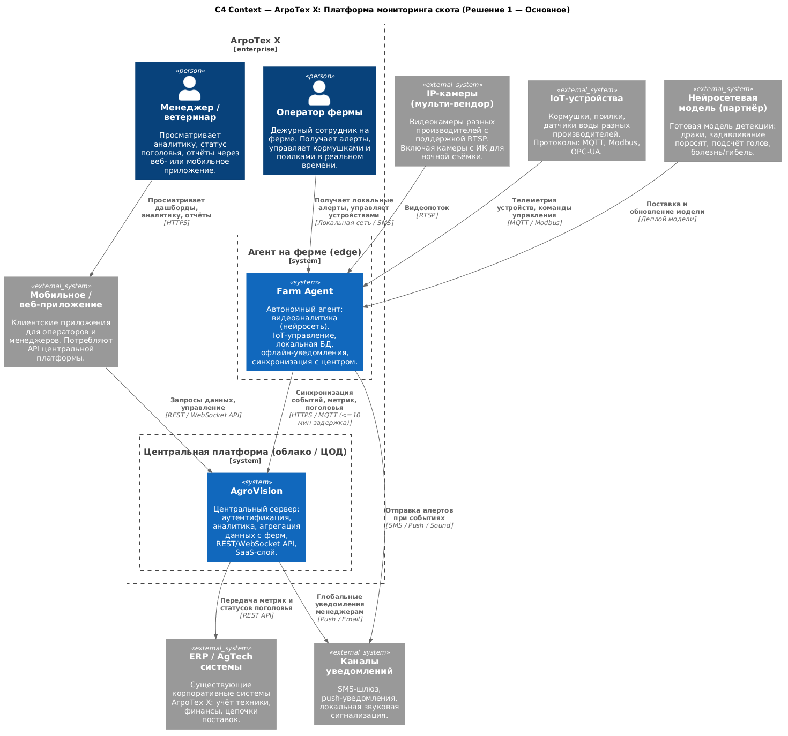
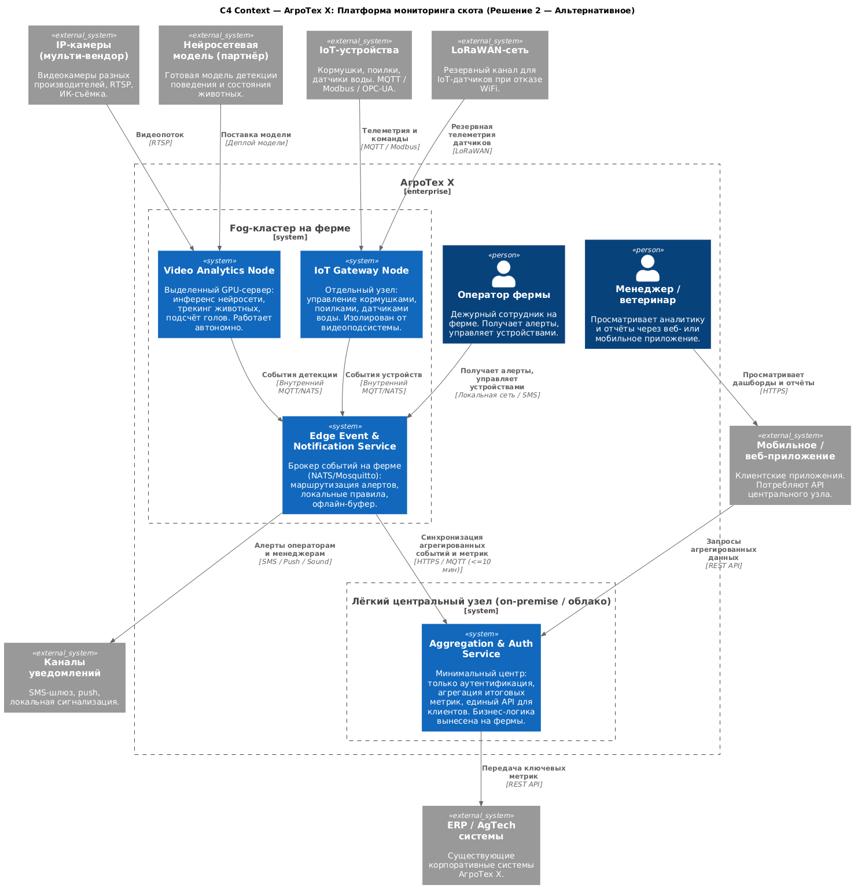

# ADR-001: Архитектура платформы мониторинга скота АгроТех X

**Название задачи:** Выбор архитектуры MVP платформы мониторинга свиноводческих ферм

**Автор:** Кирилл Иванов

**Дата:** 2026-03-14

---

## Функциональные требования

| № | Действующие лица или системы | Use Case | Описание |
|:-:|:--|:--|:--|
| 1 | Оператор фермы, Система видеоаналитики | Обнаружение драк и беспокойного поведения | Оператор получает алерт в течение ≤5 сек с момента фиксации инцидента. Шаги: 1) Камера передаёт RTSP-поток на агент; 2) Нейросеть анализирует кадры в реальном времени; 3) Event Engine формирует событие; 4) Оператор получает push/SMS/звуковой сигнал. |
| 2 | Оператор фермы, Система видеоаналитики | Обнаружение задавливания поросят | Система выявляет позу и перекрытие тела поросёнка взрослым животным. Шаги: 1) Нейросеть обнаруживает характерную позу; 2) Событие фиксируется с координатами и временем; 3) Оператор получает немедленный алерт; 4) Событие сохраняется в локальной БД. |
| 3 | Оператор фермы, IoT Hub | Управление кормушками и поилками | Оператор или система управляет устройствами разных производителей. Шаги: 1) Оператор задаёт расписание или параметры в UI; 2) Команда передаётся на IoT Hub агента; 3) IoT Hub транслирует команду по MQTT/Modbus; 4) Статус исполнения возвращается оператору. |
| 4 | Система видеоаналитики | Оценка состояния животных | Нейросеть классифицирует состояние каждого животного (здорово, болеет, погибло, беспокойно). Шаги: 1) Кадр анализируется нейросетью; 2) Классификация сохраняется в локальную БД; 3) Аномальные статусы эскалируются как алерты; 4) История доступна менеджеру через API. |
| 5 | IoT Hub | Мониторинг систем фильтрации воды | Система отслеживает параметры датчиков (давление, мутность, уровень). Шаги: 1) Датчики воды передают телеметрию на IoT Hub; 2) Hub проверяет значения по пороговым правилам; 3) При выходе за пределы — алерт оператору; 4) Данные синхронизируются с центральным сервером. |
| 6 | Система видеоаналитики | Пересчёт поголовья | Система автоматически подсчитывает количество животных в зоне видимости. Шаги: 1) Нейросеть детектирует и считает особей на кадре; 2) Результат сохраняется с меткой времени; 3) Расхождение с ожидаемым числом — алерт менеджеру; 4) История подсчётов доступна в аналитике. |
| 7 | IoT Hub, Менеджер | Мониторинг запасов корма и прогнозирование | Система отслеживает уровень корма и прогнозирует дату пополнения. Шаги: 1) Датчики уровня в кормушках передают данные; 2) Алгоритм рассчитывает средний расход; 3) При достижении порога — уведомление; 4) Прогноз отображается в дашборде. |
| 8 | Farm Agent, Оператор фермы | Работа в офлайн-режиме и синхронизация | Система работает без интернета и синхронизируется при восстановлении. Шаги: 1) Агент обнаруживает потерю связи; 2) События сохраняются в локальную БД; 3) Алерты доставляются оператору по локальной сети/SMS; 4) При восстановлении — инкрементная синхронизация с центром (≤10 мин). |
| 9 | Менеджер, Ветеринар | Просмотр аналитики и отчётов | Пользователь просматривает данные через веб- или мобильное приложение. Шаги: 1) Пользователь открывает приложение; 2) Запрос данных через REST API центральной платформы; 3) Платформа возвращает агрегированные данные с ферм; 4) Пользователь фильтрует и экспортирует отчёты. |
| 10 | Внешние системы, Центральная платформа | Интеграция с ERP и AgTech-системами | Платформа передаёт базовые метрики в существующие корпоративные системы. Шаги: 1) Центральная платформа агрегирует метрики со всех ферм; 2) По расписанию или webhook передаёт данные в ERP; 3) Поддерживается добавление собственных метрик через API. |

---

## Нефункциональные требования

| № | Требование |
|:-:|:--|
| 1 | **Доступность 99,95%** — допустимое время простоя не более ~4,4 часа в год. Агент на ферме должен работать автономно при потере связи с центральным сервером. |
| 2 | **Производительность видеоаналитики** — от момента инцидента до отправки уведомления оператору не более 5 секунд. |
| 3 | **Реальное время** — инференс нейросетевой модели выполняется в миллисекундах на кадр (GPU/NPU на агенте). |
| 4 | **Офлайн-устойчивость** — система полностью функционирует без интернета; при восстановлении — автоматическая синхронизация с задержкой ≤10 минут. |
| 5 | **Расширяемость** — добавление нового функционала (тип детекции, тип устройства) не требует изменения существующих компонентов. |
| 6 | **Масштабируемость** — количество ферм-агентов не ограничено; центральная платформа масштабируется горизонтально. |
| 7 | **Мультивендорность** — поддержка камер и IoT-устройств разных производителей (RTSP, MQTT, Modbus, OPC-UA). |
| 8 | **Безопасность** — разделение ролей (оператор, ветеринар, менеджер, администратор), OIDC-аутентификация, RBAC-авторизация. |
| 9 | **Резервные каналы связи** — нестабильный WiFi на ферме резервируется LoRaWAN (IoT) и 4G-модемом (уведомления). |
| 10 | **API для клиентов** — REST/WebSocket API для разработки мобильного и веб-приложения. |
| 11 | **Готовность к SaaS** — архитектура допускает предоставление сервиса сторонним компаниям как многотенантного SaaS-решения. |

---

## Решение

### Основное решение: единый Farm Agent + центральная платформа

#### Контекстная диаграмма (C1) (вариант 1)

#### Логика принятых решений

**Farm Agent как единый edge-узел.** Все функции агента сосредоточены в одном процессе на одном сервере. Все компоненты взаимодействуют напрямую внутри одного процесса, без передачи данных между отдельными узлами по сети, что позволяет уложиться в требование ≤5 секунд до оповещения. Единая кодовая база упрощает разработку и CI/CD на этапе MVP.

**Нейросетевой инференс на GPU агента.** Готовая модель партнёров запускается локально — зависимость от качества интернет-соединения устранена, реакция в миллисекунды гарантирована. При потере связи видеоаналитика продолжает работать в полном объёме.

**Локальное хранение и отложенная синхронизация.** Локальная БД хранит все события и телеметрию. Инкрементная синхронизация при восстановлении связи обеспечивает задержку ≤10 минут с запасом.

**Многоуровневые каналы связи.** Основной канал — WiFi/Ethernet для видеопотоков и управляющих команд. Резервный — LoRaWAN для IoT-датчиков с низким трафиком. Аварийный — 4G-модем для критических SMS-уведомлений.

**Центральная платформа с прицелом на SaaS.** Полноценный центр (OIDC, RBAC, REST/WebSocket API, аналитика) строится сразу с расчётом на многотенантность, минимизируя переработку при переходе к коммерческому SaaS.

**Мультивендорная поддержка устройств.** IoT Hub реализован через адаптерный слой: каждый производитель подключается отдельным драйвером. Добавление нового устройства — только новый адаптер без изменения ядра.

---

## Альтернативы

### Альтернативное решение: fog-кластер на ферме + лёгкий центральный узел

Вместо единого агента на ферме развёртывается кластер из трёх специализированных узлов: выделенный GPU-сервер для видеоаналитики, отдельный IoT-шлюз и брокер событий. Центральный узел сводится к минимуму — только аутентификация и агрегация итоговых метрик.

#### Контекстная диаграмма (C1) (вариант 2)

#### Сравнение решений

| Аспект | Решение 1 (принятое) | Решение 2 (альтернативное) |
|:--|:--|:--|
| Стоимость оборудования на ферму | Ниже (1 сервер) | Выше (3 узла) |
| Скорость разработки MVP | Быстрее | Медленнее |
| Изоляция отказов на ферме | Слабее: сбой агента затрагивает всё | Сильнее: видео и IoT независимы |
| Масштабируемость нагрузки | Вертикальная (ресурсы одной машины) | Горизонтальная (узлы независимы) |
| Сложность деплоя и сопровождения | Ниже | Выше (оркестрация кластера) |
| Задел для SaaS | Сильный (богатая центральная платформа) | Слабее (центр минимален) |

Альтернативное решение предпочтительнее при высокой нагрузке и строгих требованиях к изоляции отказов. Для MVP на ограниченном числе ферм оно избыточно по сложности и стоимости.

---

## Недостатки, ограничения, риски

### Недостатки основного решения

**Единая точка отказа на ферме.** Сбой единственного агента прерывает и видеоаналитику, и управление IoT-устройствами одновременно. В альтернативном решении эти подсистемы независимы.

**Ресурсное ограничение.** GPU и CPU одного сервера могут стать узким местом при большом числе камер или высокой плотности животных. Вертикальное масштабирование ограничено.

**Технический долг при переходе к SaaS.** Монолитный агент потребует декомпозиции при масштабировании до многотенантного продукта. Чем дольше откладывается рефакторинг, тем выше его стоимость.

### Ограничения

**Нейросетевая модель от партнёра.** Компания не контролирует качество, точность и скорость обновления модели. Ложные срабатывания на этапе MVP считаются допустимыми, но влияют на доверие операторов к системе.

**Качество ночной съёмки.** Камеры «рыбий глаз» снижают точность детекции из-за искажения линзы. Комбинирование разных типов камер усложняет покрытие площади и калибровку модели.

**Трекинг животных.** Высокая визуальная схожесть особей делает надёжную идентификацию конкретного животного технически сложной задачей. Для MVP некритично, но ограничивает точность истории состояния отдельного животного.

### Риски

| Риск | Вероятность | Влияние | Меры по снижению риска |
|:--|:-:|:-:|:--|
| Отказ агента на ферме (аппаратный/программный) | Средняя | Высокое | Добавление процесса мониторинга работоспособности агента, запускающий автоперезапуск сервисов; резервный 4G-канал для уведомлений |
| Переполнение GPU при росте числа камер | Средняя | Среднее | Отслеживание степени загруженности ресурсов; переход к fog-кластеру (Решение 2) для нагруженных ферм |
| Зависимость от партнёрской нейросети | Высокая | Среднее | SLA с партнёром на обновления; резервная версия модели на агенте |
| Ошибки синхронизации при длительном офлайне | Низкая | Среднее | Идемпотентные операции; версионирование записей в локальной БД |
| Рост затрат на центральную платформу при SaaS | Средняя | Среднее | Горизонтальное масштабирование с балансировщиком нагрузки; шардирование БД по тенантам |
