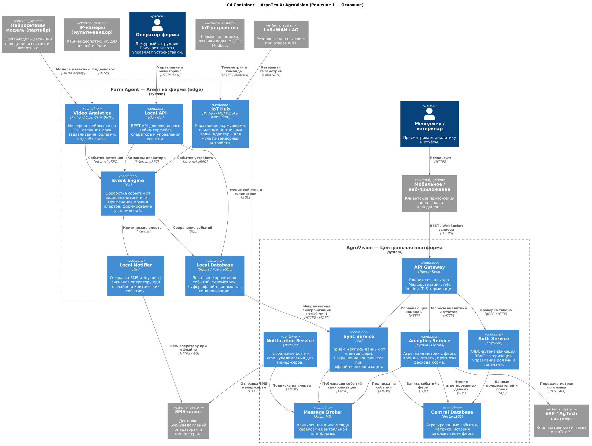
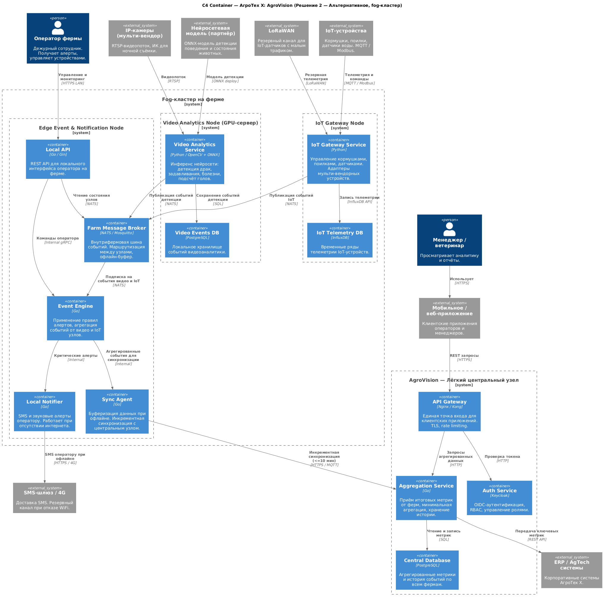

# ADR-002: Контейнерная архитектура и интеграции AgroVision

**Название задачи:** Проработка высокоуровневого видения: ограниченные контексты, контейнерные диаграммы (C2), выбор технологий интеграции

**Автор:** Кирилл Иванов

**Дата:** 2026-03-14

---

## Функциональные требования

Унаследованы из ADR-001. На уровне контейнеров добавляются требования к взаимодействию сервисов:

| № | Действующие лица или системы | Use Case | Описание |
|:-:|:--|:--|:--|
| 1 | Video Analytics, Event Engine | Передача событий детекции внутри фермы | Видеоаналитика публикует события (драка, задавливание, болезнь) во внутреннюю шину. Event Engine подписывается и применяет правила алертов. |
| 2 | IoT Hub, Event Engine | Передача телеметрии IoT | IoT Hub публикует состояние устройств и пороговые нарушения в шину. Event Engine агрегирует и маршрутизирует события. |
| 3 | Farm Agent / Sync Agent, Sync Service | Синхронизация данных с центром | Агент фермы отправляет накопленные события на центральный сервер при наличии связи. Центр принимает данные идемпотентно. |
| 4 | Auth Service, все сервисы | Аутентификация и авторизация | Все входящие запросы проверяются через Auth Service. Роли: оператор, ветеринар, менеджер, администратор. |
| 5 | Analytics / Aggregation Service, ERP | Интеграция с корпоративными системами | Центральная платформа периодически передаёт агрегированные метрики поголовья и расхода корма в ERP. |

---

## Нефункциональные требования

Унаследованы из ADR-001. Дополнения на уровне контейнеров:

| № | Требование |
|:-:|:--|
| 1 | Внутрифермовая шина событий должна работать при отсутствии интернета и накапливать сообщения до восстановления связи. |
| 2 | Инференс нейросети — не более 100 мс на кадр при работе на GPU. |
| 3 | Синхронизация с центром — инкрементная, идемпотентная, без потери событий при обрыве. |
| 4 | IoT-адаптеры должны быть изолированы от ядра: добавление нового производителя не требует изменения Event Engine. |
| 5 | Центральная БД должна поддерживать многотенантность (изоляция данных по фермам) для будущего SaaS. |

---

## Ограниченные контексты (Bounded Contexts)

Система разбита на шесть ограниченных контекстов. Каждый контекст владеет своей моделью данных и взаимодействует с другими через чётко определённые интерфейсы.

### 1. Видеоаналитика (Video Analytics BC)

**Ответственность:** получение видеопотоков, инференс нейросетевой модели, публикация событий детекции.

**Граница:** знает только о камерах и нейросетевой модели. Не знает об IoT-устройствах, пользователях и правилах уведомлений.

**Ключевые сущности:** `VideoStream`, `DetectionEvent` (тип, уверенность, координаты, временная метка), `AnimalCount`.

**Взаимодействие:** публикует `DetectionEvent` в шину событий. Потребители — Event Engine.

---

### 2. IoT и управление устройствами (IoT BC)

**Ответственность:** подключение устройств разных производителей, сбор телеметрии, выполнение управляющих команд.

**Граница:** знает об устройствах и протоколах (MQTT, Modbus, OPC-UA). Не знает о видеоаналитике и правилах алертов.

**Ключевые сущности:** `Device` (тип, производитель, протокол), `Telemetry` (значение, единица, временная метка), `Command`.

**Взаимодействие:** публикует `TelemetryEvent` и `DeviceAlert` в шину. Принимает `Command` от Event Engine.

---

### 3. Управление событиями и уведомлениями (Event & Notification BC)

**Ответственность:** агрегация событий от видеоаналитики и IoT, применение правил алертов, маршрутизация уведомлений операторам.

**Граница:** знает о правилах, подписчиках и каналах уведомлений. Оркестрирует, но не хранит сырые данные.

**Ключевые сущности:** `AlertRule` (условие, порог, действие), `Incident` (тип, статус, время), `Notification` (канал, получатель, текст).

**Взаимодействие:** подписывается на события из Video BC и IoT BC. Публикует `Incident` в Sync BC.

---

### 4. Синхронизация и офлайн-буфер (Sync BC)

**Ответственность:** надёжная доставка событий с фермы на центральный сервер, буферизация при отсутствии связи, разрешение конфликтов.

**Граница:** транспортный контекст. Не интерпретирует содержимое событий, только обеспечивает их доставку.

**Ключевые сущности:** `SyncRecord` (идентификатор, тип, payload, статус, версия), `SyncCheckpoint`.

**Взаимодействие:** читает из локальной БД, отправляет на Sync Service центральной платформы по HTTPS/MQTT.

---

### 5. Аналитика и отчётность (Analytics BC)

**Ответственность:** агрегация данных со всех ферм, построение трендов, прогнозирование расхода корма, формирование отчётов.

**Граница:** только центральная платформа. Работает с уже синхронизированными данными.

**Ключевые сущности:** `FarmMetric` (ферма, показатель, значение, период), `Report`, `FeedForecast`.

**Взаимодействие:** читает из центральной БД. Отдаёт данные через API Gateway. Интегрируется с ERP.

---

### 6. Управление доступом (Identity & Access BC)

**Ответственность:** аутентификация пользователей, выдача токенов, RBAC-авторизация.

**Граница:** сквозной контекст. Все сервисы центральной платформы и агенты ферм проверяют токены через этот контекст.

**Ключевые сущности:** `User`, `Role` (оператор, ветеринар, менеджер, администратор), `Token`, `Permission`.

**Взаимодействие:** все входящие запросы через API Gateway проходят проверку токена.

---

## Решение

### Основное решение: единый Farm Agent + центральная платформа

Все шесть ограниченных контекстов реализованы как отдельные сервисы. На ферме — четыре контейнера в рамках единого агента. В центре — четыре сервиса с общей шиной.

#### Контекстная диаграмма (C2) (вариант 1)

#### Логика принятых решений

**RabbitMQ как шина центральной платформы.** Центральная платформа использует RabbitMQ для асинхронной связи между сервисами. RabbitMQ поддерживает AMQP и MQTT (через плагин), хорошо известен команде, не требователен к ресурсам и поддерживает кластеризацию. Ограничение: при высокой нагрузке (тысячи ферм в SaaS-режиме) может потребоваться переход на Kafka.

**gRPC для внутрифермового взаимодействия.** Сервисы агента (Video Analytics → Event Engine, IoT Hub → Event Engine) общаются через gRPC: строгая типизация контракта, низкая задержка, двунаправленный стриминг. Это важно для выполнения требования ≤5 секунд до оповещения.

**ONNX для нейросетевой модели.** Формат ONNX позволяет запускать модель партнёра независимо от фреймворка обучения и ускорять инференс через ONNX Runtime с GPU-бэкендом (CUDA). Замена модели — только обновление файла без изменения кода.

**Keycloak для Auth Service.** Готовое решение с поддержкой OIDC, RBAC, Federation (LDAP/AD) и управления сессиями. Снижает объём самописного кода безопасности. Может быть развёрнут как на центральной платформе, так и как embedded-экземпляр на агенте для офлайн-аутентификации.

**PostgreSQL на агенте.** Для локальной БД агента выбран PostgreSQL (или SQLite для минимальных конфигураций): надёжный, поддерживает транзакции, легко мигрирует схему. Данные синхронизируются инкрементно по версии записи (optimistic locking).

---

## Альтернативы

### Альтернативное решение: fog-кластер на ферме + лёгкий центральный узел

Функциональность агента разнесена по трём специализированным узлам с NATS как внутрифермовой шиной. Центральный узел минимален.

#### Контейнерная диаграмма (C2) (вариант 2)

#### Ключевое отличие: NATS вместо gRPC

В fog-кластере узлы общаются через **NATS** вместо прямых gRPC-вызовов. NATS — легковесный pub/sub брокер с поддержкой офлайн-буферизации (JetStream), устойчив к кратковременным отказам отдельных узлов кластера. Это усиливает изоляцию: падение Video Analytics Node не блокирует IoT Gateway Node.

Компромисс: NATS добавляет ещё один компонент для эксплуатации на ферме; задержка доставки события чуть выше, чем при прямом gRPC-вызове.

#### InfluxDB для IoT-телеметрии

В альтернативном решении IoT-узел использует **InfluxDB** для хранения временных рядов телеметрии вместо PostgreSQL. InfluxDB оптимизирован для высокочастотных числовых данных с временными метками (уровень корма, давление воды, температура). Запросы по временным диапазонам работают значительно быстрее, чем в реляционной БД.

Компромисс: дополнительная технология в стеке; команде нужно владеть InfluxDB наряду с PostgreSQL.

---

## Выбор технологий интеграции — обоснование и компромиссы

### RabbitMQ (центральная платформа, Решение 1)

**Преимущества:**
- Поддержка MQTT через плагин — единый брокер для центра и частично для агентов.
- Широко распространён, большая экосистема, хорошая документация.
- Не требователен к ресурсам на старте.
- Поддерживает кластеризацию и зеркалирование очередей.
- Гарантия доставки (acknowledgements, dead-letter queues).

**Ограничения:**
- При высокой нагрузке (тысячи ферм, большой поток событий) становится узким местом — лучше перейти на Kafka.
- Не оптимален для хранения и воспроизведения потоков событий (event sourcing).

---

### NATS / JetStream (fog-кластер, Решение 2)

**Преимущества:**
- Крайне низкая задержка, минимальные требования к памяти и CPU.
- JetStream обеспечивает персистентность и буферизацию сообщений при офлайне.
- Простая модель pub/sub, подходит для распределённых edge-сред.
- Встроенная поддержка кластеризации.

**Ограничения:**
- Менее распространён, чем RabbitMQ или Kafka — меньше готовой экспертизы в командах.
- Более молодая экосистема.

---

### gRPC (внутрифермовое взаимодействие, Решение 1)

**Преимущества:**
- Строгая типизация контракта через Protobuf — меньше ошибок интеграции.
- Низкая задержка (HTTP/2, бинарный протокол) — критично для цепочки «камера → алерт».
- Поддержка двунаправленного стриминга видеособытий.

**Ограничения:**
- Сложнее отлаживать, чем REST.
- Требует генерации клиентского кода из .proto-файлов.

---

### RTSP (видеопоток)

**Преимущества:**
- Универсальный стандарт для IP-камер всех производителей.
- Поддерживается OpenCV и большинством видеобиблиотек «из коробки».

**Ограничения:**
- Нет встроенного механизма восстановления потока при обрыве — требует обёртки с логикой переподключения.
- Высокое потребление трафика внутри локальной сети фермы при большом числе камер.

---

### MQTT / Modbus (IoT-устройства)

**Преимущества:**
- MQTT — де-факто стандарт для IoT, поддерживается большинством современных устройств.
- Modbus — стандарт для промышленного оборудования, широко используется в сельскохозяйственной технике.
- Оба протокола экономичны по трафику, работают при нестабильном соединении.

**Ограничения:**
- Для устройств с OPC-UA потребуется дополнительный адаптер.
- Modbus не поддерживает подтверждение доставки — возможна потеря команды при обрыве.

---

### PostgreSQL (основная БД)

**Преимущества:**
- Надёжный, проверенный, поддерживает JSONB для гибкого хранения payload событий.
- Подходит как для центральной платформы, так и для локальной БД агента.
- Поддерживает row-level security — нужно для многотенантности в SaaS.

**Ограничения:**
- Не оптимален для высокочастотных временных рядов IoT-телеметрии (решается InfluxDB в Решении 2 или расширением TimescaleDB).

---

## Недостатки, ограничения, риски

### Недостатки основного решения (Решение 1)

**Смешанная ответственность агента.** Video Analytics, IoT Hub и Event Engine работают в рамках одного агента. При высокой нагрузке на GPU видеоаналитика конкурирует с остальными процессами за ресурсы CPU и памяти.

**PostgreSQL для IoT-телеметрии.** Высокочастотная телеметрия (десятки показаний в секунду с множества датчиков) может создавать нагрузку на реляционную БД. Решение: партиционирование по времени или замена на TimescaleDB.

### Недостатки альтернативного решения (Решение 2)

**Сложность операционного управления кластером.** Три физических узла на ферме требуют оркестрации (минимум — systemd + мониторинг, оптимально — K3s). Это повышает требования к квалификации персонала сопровождения.

**Сетевая связность внутри кластера.** Узлы должны надёжно общаться между собой по локальной сети фермы. Сбой коммутатора затрагивает весь кластер.

### Общие риски

| Риск | Вероятность | Влияние | Меры по снижению риска |
|:--|:-:|:-:|:--|
| Качество партнёрской модели (ложные срабатывания) | Высокая | Среднее | Настройка порогов уверенности; версионирование моделей; A/B тестирование новых версий |
| Рост нагрузки при увеличении числа камер | Средняя | Высокое | Мониторинг загруженности GPU; вертикальное масштабирование или переход к fog-кластеру |
| Отказ RabbitMQ на центральной платформе | Низкая | Высокое | Кластер RabbitMQ из двух узлов с зеркалированием очередей |
| Потеря данных при длительном офлайне агента | Низкая | Высокое | Локальная БД с WAL; идемпотентная синхронизация по версиям записей |
| Несовместимость новых IoT-устройств | Средняя | Среднее | Адаптерный слой изолирован; новый производитель — только новый адаптер без изменения ядра |
