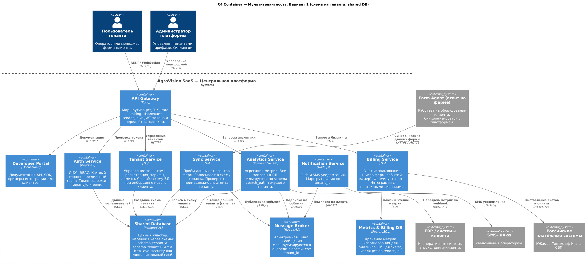
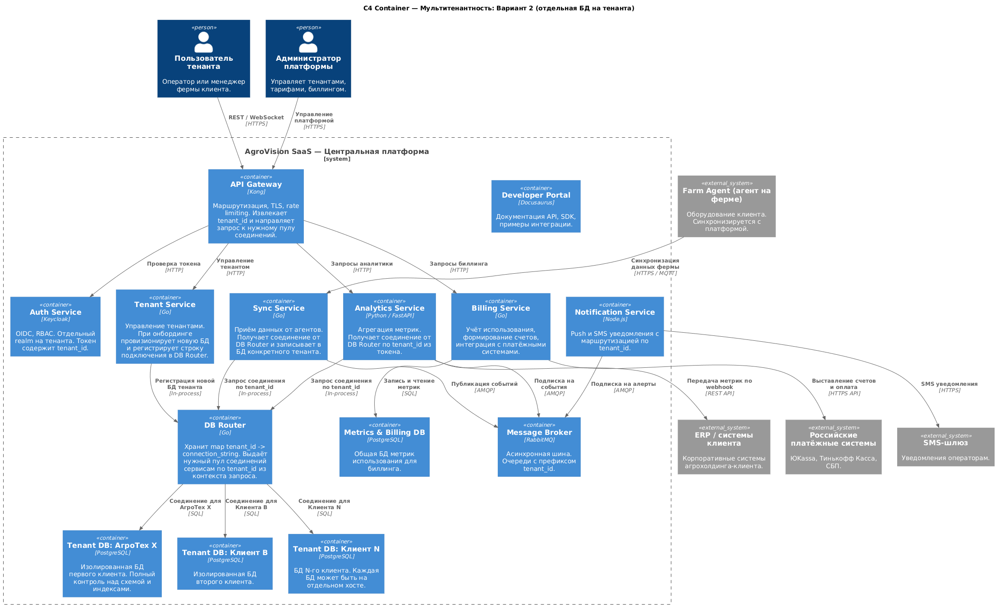
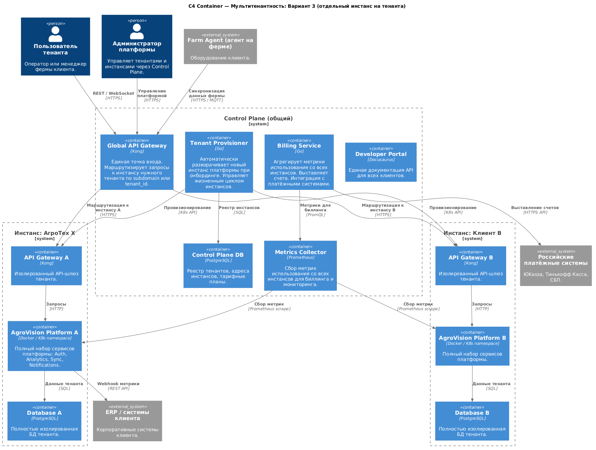
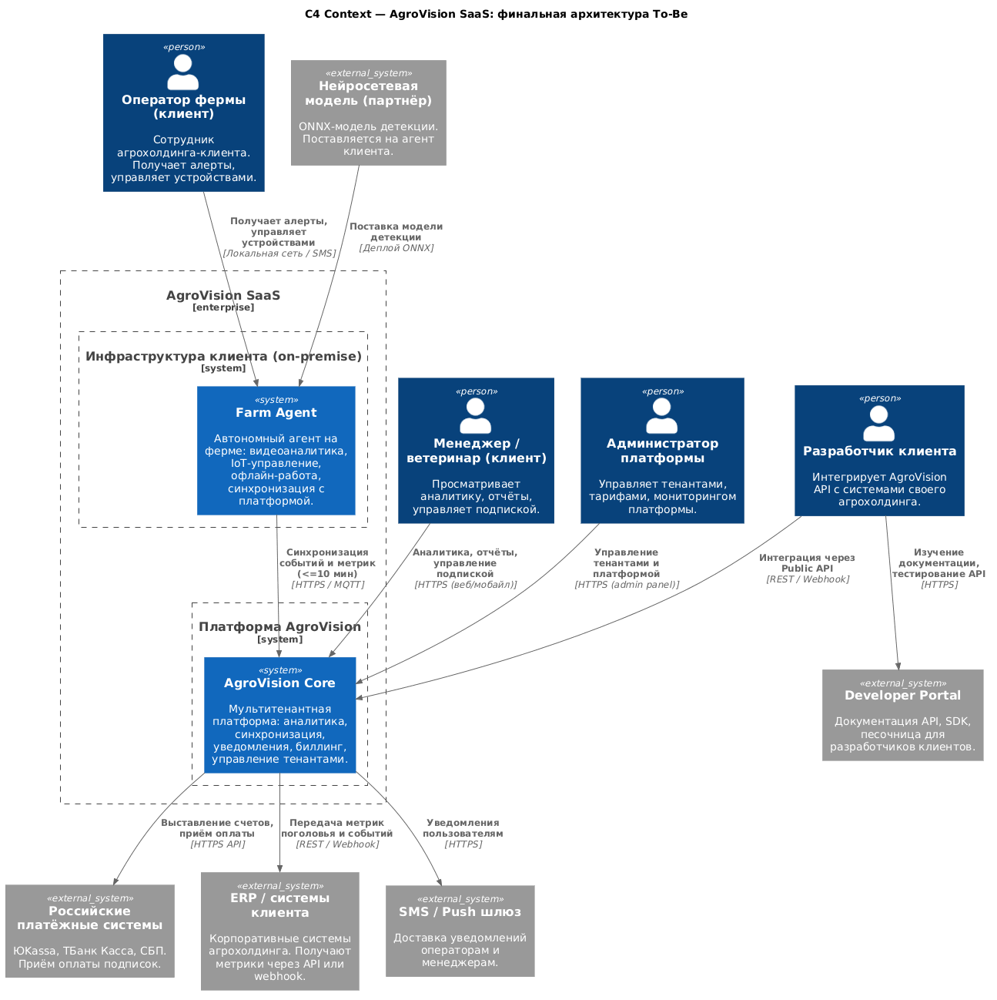
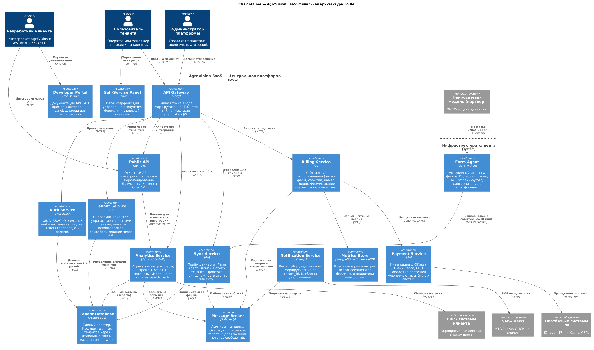
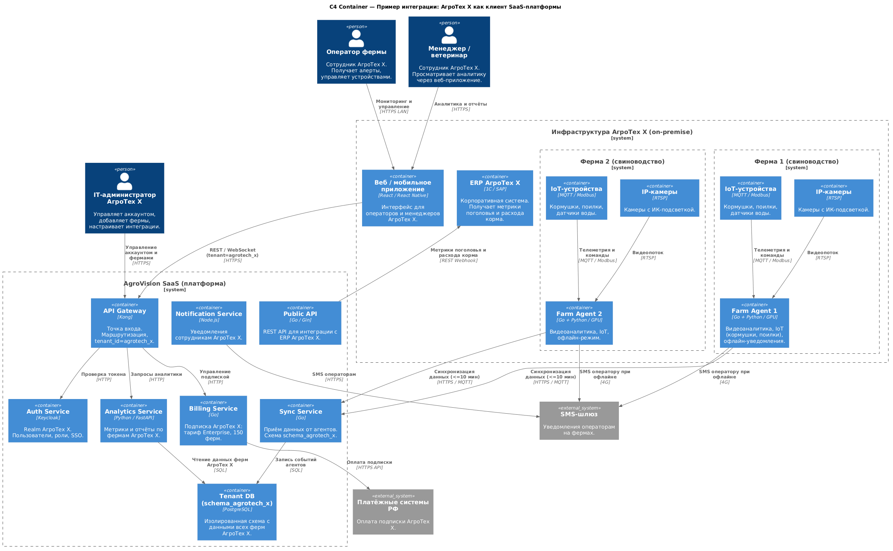

# ADR-004: Эволюция MVP в SaaS-платформу AgroVision

**Название задачи:** Проектирование мультитенантной архитектуры, биллинга и клиентских интеграций

**Автор:** Кирилл Иванов

**Дата:** 2026-03-14

**Ссылка на основной вариант:** ADR-003, Решение 1 — единый Farm Agent + центральная платформа

---

## Функциональные требования

| № | Действующие лица или системы | Use Case | Описание |
|:-:|:--|:--|:--|
| 1 | Tenant Service, новый клиент | Онбординг нового агрохолдинга | Клиент регистрируется через Self-Service Panel. Шаги: 1) Клиент заполняет форму регистрации; 2) Tenant Service создаёт схему БД и realm в Keycloak; 3) Клиент получает API-ключ и инструкцию по установке Farm Agent; 4) Клиент подключает первую ферму. |
| 2 | Billing Service, Payment Service | Оплата подписки | Клиент оплачивает ежемесячную подписку. Шаги: 1) Billing Service формирует счёт по метрикам использования; 2) Payment Service инициирует платёж через ЮKassa или СБП; 3) Платёжная система возвращает webhook о статусе; 4) При успехе — продление подписки, при отказе — уведомление и "grace period" (продолжает пользоваться сервисом в течение N дней — за это время он может исправить ситуацию с оплатой). |
| 3 | Public API, разработчик клиента | Интеграция с ERP клиента | Разработчик агрохолдинга подключает свою ERP к AgroVision. Шаги: 1) Разработчик изучает документацию на Портале разработчика; 2) Получает API-ключ в Self-Service Panel; 3) Настраивает webhook на получение метрик; 4) ERP получает данные о поголовье и расходе корма. |
| 4 | Analytics Service, менеджер клиента | Просмотр аналитики по всем фермам | Менеджер видит сводную аналитику своего агрохолдинга. Шаги: 1) Авторизация через OIDC с tenant_id; 2) API Gateway направляет запрос с tenant_id; 3) Analytics Service читает только из схемы своего тенанта; 4) Данные других тенантов физически недоступны. |
| 5 | Tenant Service, платформа | Управление тарифными планами | Клиент самостоятельно меняет тарифный план. Шаги: 1) Менеджер выбирает новый тариф в Self-Service Panel; 2) Tenant Service обновляет лимиты (число ферм, камер, частота синхронизации); 3) Billing Service пересчитывает стоимость; 4) Изменение применяется немедленно или с начала следующего периода. |
| 6 | Metrics Store, Billing Service | Сбор метрик для биллинга | Платформа непрерывно собирает метрики использования. Шаги: 1) Sync Service публикует событие каждой синхронизации в шину; 2) Billing Service подписывается и записывает метрики в Metrics Store; 3) В конце периода формируется счёт на основе фактического потребления. |

---

## Нефункциональные требования

| № | Требование |
|:-:|:--|
| 1 | **Изоляция данных** — данные одного тенанта должны быть физически или логически недоступны другим тенантам на всех уровнях. |
| 2 | **Масштабируемость** — платформа должна обслуживать от единиц до сотен тенантов без изменения архитектуры. |
| 3 | **Совместимость с российскими платёжными системами** — ЮKassa, ТБанк Касса, СБП. Зарубежные платёжные шлюзы не применимы. |
| 4 | **Самообслуживание** — клиент должен иметь возможность зарегистрироваться, подключить фермы и получить API-ключ без участия технической поддержки. |
| 5 | **Документация для разработчиков** — OpenAPI-спецификация, SDK, примеры интеграции, "песочница" для тестирования (изолированное тестовое окружение). |
| 6 | **Биллинг по фактическому потреблению** — тарификация на основе числа ферм, камер, событий детекции, объёма синхронизируемых данных. |
| 7 | **Доступность** — 99,95% с учётом независимости работы Farm Agent при недоступности платформы. |

---

## Решение

### Задача 1. Варианты изоляции данных

Рассмотрены три варианта мультитенантной изоляции данных.

---

#### Вариант 1: Schema-per-tenant (одна схема на тенанта)

Все тенанты хранятся в одном PostgreSQL-кластере, но каждый тенант получает отдельную схему (`schema_agrotech_x`, `schema_client_b` и т.д.). Сервисы получают tenant_id из JWT-токена и устанавливают `search_path` перед каждым запросом. В качестве дополнительного слоя защиты применяется Row-Level Security (механизм PostgreSQL, который ограничивает доступ к строкам таблицы на уровне самой базы данных).

---

#### Вариант 2: Database-per-tenant (отдельная БД на тенанта)

Каждый тенант получает отдельную PostgreSQL-базу данных. DB Router хранит маппинг tenant_id → строка подключения и выдаёт нужный connection pool сервисам. При регистрации нового клиента Tenant Service автоматически создаёт для него отдельную базу данных.

---

#### Вариант 3: Instance-per-tenant (отдельный инстанс на тенанта)

Каждый тенант получает полностью изолированный набор контейнеров платформы (отдельный API Gateway, сервисы, БД) в выделенном K8s namespace. Общий Control Plane управляет жизненным циклом инстансов и агрегирует метрики для биллинга.

---

#### Критерии сравнения вариантов изоляции

| Критерий | Вариант 1: Schema | Вариант 2: Database | Вариант 3: Instance |
|:--|:-:|:-:|:-:|
| Уровень изоляции данных | Логическая | Логическая + физическая | Полная физическая |
| Стоимость инфраструктуры | Низкая (1 кластер) | Средняя (N баз) | Высокая (N инстансов) |
| Сложность онбординга | Низкая (DDL-миграция) | Средняя (новая БД) | Высокая (K8s деплой) |
| Масштабируемость | До ~500 тенантов | До ~1000 тенантов | Неограниченно |
| Соответствие требованиям СУБД | Стандартный PostgreSQL | Стандартный PostgreSQL | Полный контроль |
| Резервное копирование | Единый бэкап кластера | Бэкап на тенанта | Бэкап на тенанта |
| Подходит для крупных клиентов | Частично | Да | Да |
| Скорость разработки MVP SaaS | Высокая | Средняя | Низкая |

**Выбран Вариант 1 (schema-per-tenant)** как базовый для MVP SaaS: минимальная операционная сложность, достаточная изоляция для начального числа клиентов. Вариант 2 применяется для крупных клиентов (enterprise-тариф) по запросу — Tenant Service поддерживает оба режима провизионирования.

---

### Задача 2. Биллинг и монетизация

#### Тарифные планы

| Тариф | Лимиты | Основание тарификации |
|:--|:--|:--|
| Starter | до 5 ферм, до 10 камер на ферму | Фиксированная ежемесячная плата |
| Business | до 30 ферм, до 30 камер | Фиксированная плата + надбавка за превышение |
| Enterprise | без ограничений, SLA 99,95% | Индивидуальный договор, отдельная БД |

#### Метрики для биллинга

Billing Service собирает метрики по событиям в шине и периодическим снимкам состояния:

- число активных ферм тенанта;
- число подключённых камер;
- количество событий детекции за период;
- объём данных синхронизации (МБ);
- число API-запросов к Public API.

#### Интеграция с российскими платёжными системами

Выбраны три интеграции, закрывающие основные сценарии:

**ЮKassa** — основной шлюз для оплаты банковскими картами и электронными кошельками. Поддерживает рекуррентные платежи для автоматического списания по подписке.

**ТБанк Касса** — альтернативный шлюз, подключается как резервный при недоступности ЮKassa. Также поддерживает рекуррентные платежи.

**СБП (Система быстрых платежей)** — для разовых оплат и крупных корпоративных переводов через QR-код или ссылку. Актуально для enterprise-клиентов с внутренними регламентами.

Payment Service принимает webhooks от всех трёх систем и нормализует их в единую модель платёжного события. При неуспешном платеже — grace period 7 дней с ежедневными уведомлениями, затем ограничение доступа (read-only режим без алертов).

---

### Задача 3. Клиентские интеграции и Портал разработчика

#### Public API — scope функционала

Public API предоставляет клиентам доступ к следующим группам эндпоинтов:

**Фермы и агенты** — получение списка ферм, статуса агентов, последнего времени синхронизации.

**Поголовье** — текущее количество животных по ферме, история подсчётов, динамика за период.

**Инциденты** — список инцидентов с фильтрацией по ферме, типу, статусу, временному диапазону. Подтверждение и закрытие инцидентов.

**Метрики** — агрегированные показатели (расход корма, активность, здоровье) по ферме и поголовью за период.

**Webhooks** — подписка на события в реальном времени: новый инцидент, изменение статуса животного, достижение порога расхода корма.

**Устройства** — статус кормушек, поилок, датчиков воды. Отправка управляющих команд (при наличии прав).

#### Аутентификация API

Клиентские интеграции используют API-ключи (статические, для серверных интеграций) или OAuth 2.0 Client Credentials (для сервис-к-сервис). JWT-токены со scope, соответствующим тарифному плану.

#### Портал разработчика

Построен на Docusaurus и содержит:

- OpenAPI 3.0 спецификацию с интерактивным Swagger UI;
- SDK для Python и Go (генерируются из OpenAPI);
- примеры интеграции с популярными российскими ERP (1С, SAP);
- "песочница" с тестовыми данными для разработки без реального агента;
- Журнал изменений версий API с гарантией того, что устаревшая версия продолжает работать ещё 6 месяцев после выхода новой — за это время клиенты успевают обновить свои интеграции.

---

### Задача 4. Финальная архитектура To-Be

#### C1 — Контекстная диаграмма SaaS

#### C2 — Контейнерная диаграмма SaaS
> Файл: `c4-container-saas-tobe.puml`

#### C2 — Пример интеграции: АгроТех X как клиент

АгроТех X подключается к собственной платформе как первый клиент на Enterprise-тарифе. 150 ферм — 150 Farm Agent, каждый синхронизируется с платформой. Данные хранятся в схеме `schema_agrotech_x`. ERP компании получает метрики через Public API по webhook.

---

## Альтернативы

**Schema-per-tenant vs Database-per-tenant** — описано в разделе сравнения вариантов изоляции выше. Вариант 2 зарезервирован для enterprise-тенантов.

**Instance-per-tenant** — целесообразен при выходе на крупных клиентов с требованиями полной физической изоляции (государственные агрохолдинги, требования регулятора). На этапе SaaS MVP избыточен.

**Kafka вместо RabbitMQ** — при росте числа тенантов и объёма событий (>1 млн событий/сутки) RabbitMQ может стать узким местом. Переход на Kafka возможен без изменения контрактов сервисов — только замена брокера.

---

## Недостатки, ограничения, риски

| Риск | Вероятность | Влияние | Меры по снижению риска |
|:--|:-:|:-:|:--|
| Утечка данных между тенантами при ошибке в search_path | Низкая | Критическое | Автотесты на изоляцию при каждом деплое; Row-Level Security как второй слой; code review политика на все SQL-запросы |
| Недоступность платёжного шлюза | Средняя | Высокое | Два резервных шлюза (ЮKassa + ТБанк); grace period N дней; ручная оплата по счёту для enterprise |
| Рост числа схем БД замедляет работу кластера | Средняя | Среднее | Партиционирование по tenant_id в TimescaleDB для метрик; мониторинг размера схем; переход к database-per-tenant для крупных тенантов |
| Отсутствие специального интерфейса администратора | Высокая | Среднее | Временное решение: admin API с базовыми операциями; выделенный admin UI — следующий спринт |
| Требования регулятора к хранению данных (152-ФЗ) | Высокая | Высокое | Все данные клиентов хранятся на серверах в РФ; DPA с каждым тенантом; шифрование данных в покое и в транзите |
